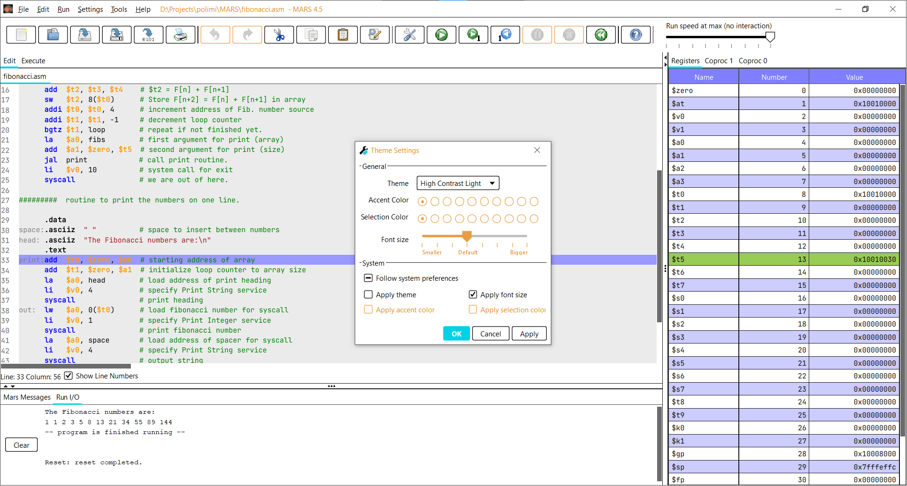

# MIPS Assembler and Runtime Simulator

[MARS fork (?)](http://courses.missouristate.edu/kenvollmar/mars/) cleaned up and gradleized
so that I can hopefully build an .exe and install it properly.

Also added themes using the [Darklaf](https://github.com/weisJ/darklaf) library

## Screenshots

|   | 
|---|
|  |
|  |
|  |
|  |
|  |
|  |
|  |

## License
See http://courses.missouristate.edu/kenvollmar/mars/license.htm